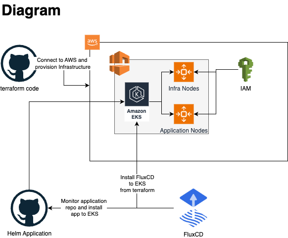

## Applications
- **Terraform** — AWS infrastructure provisioning (VPC, EKS, IAM)
- **Flux v2** — Continuous delivery to Kubernetes via GitOps
- **Helm** — Application templating and versioning
- **GitHub Actions** — CI/CD pipeline (build, test, deploy, scan)
- **Makefile** — Local automation for build, deploy, and scan

---

## CI/CD

- Automatic build & push of Docker image on merge to `master`
- Lint (Docker, YAML, Helm), test, scan on Pull Requests
- Image update via `kustomize edit set image`
- Static analysis via Docker scan
- Auto-deployment via Flux

---

## Deployment Flow



1. Terraform provisions AWS infrastructure with AWS OIDC
2. EKS cluster is created with node pools (infra/app)
3. Flux is deployed on infra nodes and connects to GitHub
4. Helm chart deployed for `echo_app` via Flux
5. CI/CD pipeline updates Docker image and YAML definitions

---

## Running locally

```bash
make lint        # Run linter checks
make build       # Build Docker image
make push        # Push Docker image
make deploy      # Update image in kustomization.yaml
```

## Improvements
1. Move applications to separate repo
2. Add monitoring and observability
3. Auto-release for the applications
3. Improve terraform code with variables, make it more flexible
4. Install additional plugins for AWS Load balances, secres.
5. Adjust scaling mechanic for nodes
6. Certificate management for exposed applications
7. Add service-mesh with istio
8. Authentication and cluster access - define roles, serviceaccounts, trustrelationships
9. Add terraform code checks - checkov, TFSec, TFLint
